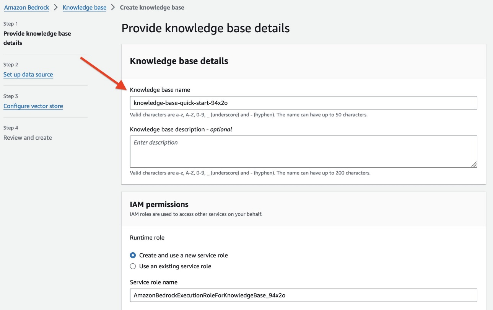
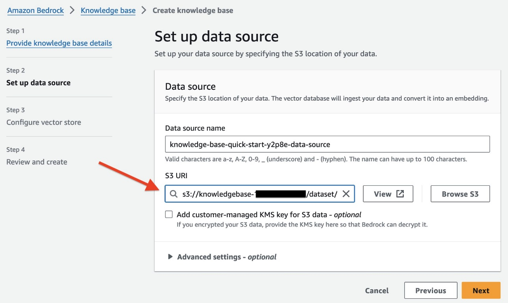
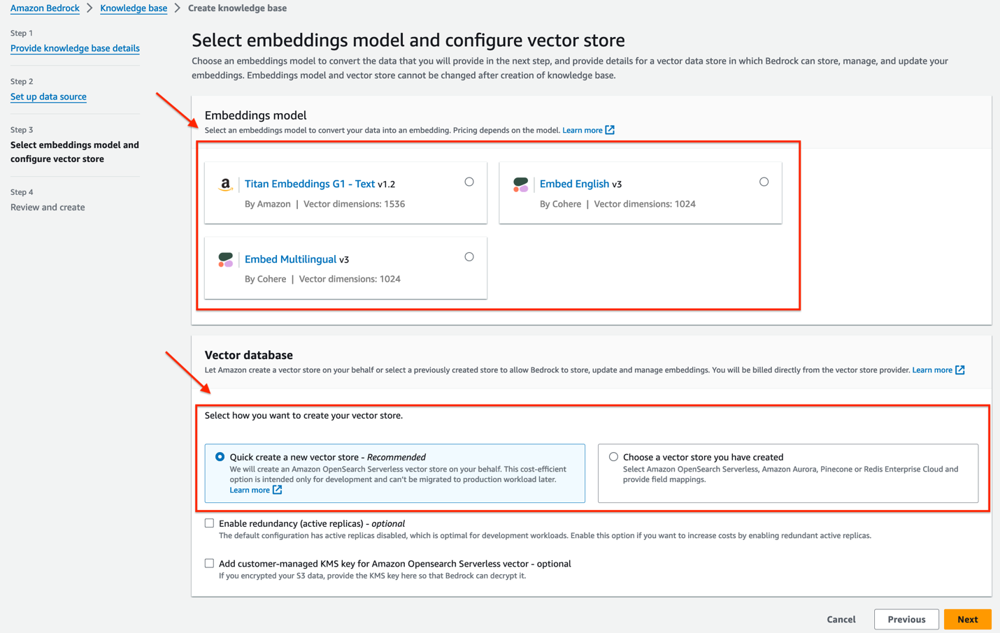

# :orange_book: Creating a Knowledge Base on AWS

## What is Knowledge Bases for Bedrock?
Knowledge Bases for Amazon Bedrock is a fully managed capability that helps you implement the entire RAG workflow from ingestion to retrieval and prompt augmentation without having to build custom integrations to data sources and manage data flows. Session context management is built in, so your app can readily support multi-turn conversations.

Knowledge Bases for Amazon Bedrock securely connect FMs and agents to data sources. Simply point to the location of your data in Amazon S3, and Knowledge Bases for Amazon Bedrock automatically fetches the documents, divides them into blocks of text, converts the text into embeddings, and stores the embeddings in your vector database.

## How to setup a Semiconductor Design Knowledge Base?

#### Step 1: Preparing data and creating a S3 bucket

###### Data Sourcing
There are several publicly available documentation on semiconductor EDA tools. Here are some publicly available reference links from where you can download documents for your RAG Pipeline:
[ Note: These links were visible through web searches as of April 2nd 2024. They may or may not be visible when you run this demo. All products and related trademarks mentioned herein are the property of their respective owners.]

- https://www.brown.edu/Departments/Engineering/Courses/engn1600/Assignments/Cadence_Tutorial_EN1600.pdf
- https://bpb-us-w2.wpmucdn.com/sites.gatech.edu/dist/0/367/files/2016/03/Intro_to_skill_prog.pdf
- https://picture.iczhiku.com/resource/eetop/WYiGePwqkEhquBcc.pdf
- https://eda.ncsu.edu/tutorials/custom-digital/
- https://users.ece.utexas.edu/~patt/10s.382N/handouts/vcs.pdf
- https://picture.iczhiku.com/resource/eetop/wHkyejiRhoyhDCcb.pdf 

If you have your own documentation, you can upload those to an s3 bucket as well. Please make sure you follow your organization IT security policies for documents. 

###### Creating an S3 bucket.
Please login into your AWS account and search for Amazon S3 and navigate to S3 Console. Click on create S3 bucket. 

After selecting a region, specifying a unique name for your bucket, leave all other settings as default and click Create Bucket. 

#### Step2: Creating a knowledge base
From your AWS Console, search for Amazon Bedrock. 

On the left hand panel, navigate to Knowledge Bases

Click on "Create Knowledge Base".

Provide knowledge base details which include a name, description and IAM permissions. For the purpose of this demo, please select "Create and use a new service role" and click Next.

Set up a data source by selecting the S3 bucket you have created earlier. For easy selection, click on browse S3 to select your bucket. Click Next.

Now select the embeddings model and configure your vector store. For this demo, we will use Cohere Embed English v3 embeddings model and choose the "Quick create a new vector store" option to setup a Amazon OpenSearch Serverless vector store. Click Next. 

Once you have reviewed and verified all the details, click on "Create Knowledge Base"

It will take a few moments to get your knowledge base ready. Once done, go back to the Knowlegde Base console where you started the creation process. Click on your knowledge base name and copy the Knowledge base ID. This is the knowledge base ID you will enter in your streamlit application for RAG queries. 