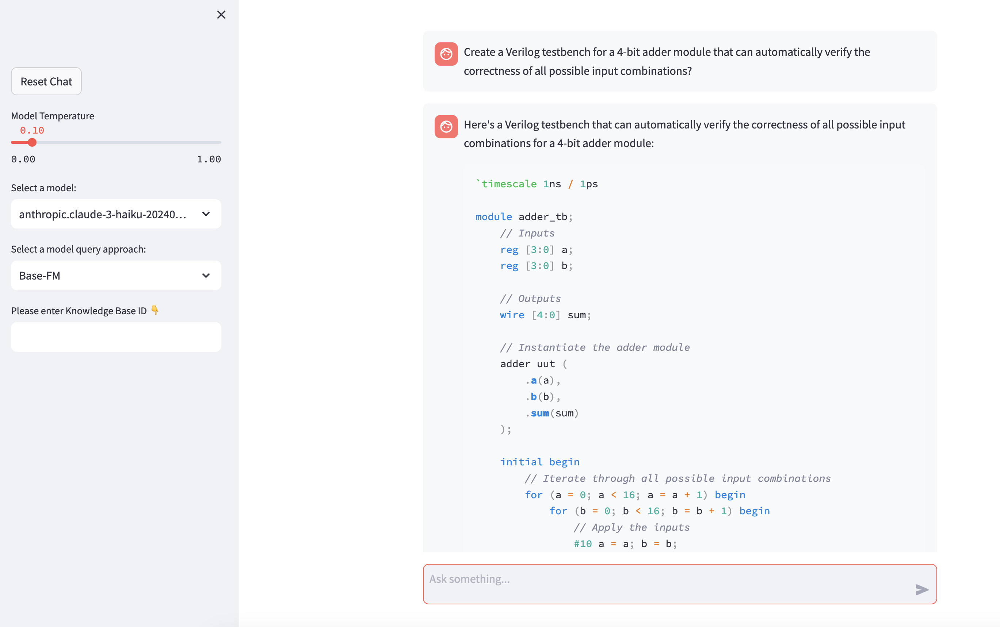

# :trackball: Semiconductor Design and Electronic Design Automation (EDA) Engineering Assistant

## Conversational Interface for interacting with EDA documentation and reference methodology documents 

Generative design methodologies powered by AI can automatically design chips and electronic subsystems given the right prompts and desired parameters and constraints without intensive engineering efforts, freeing up resources. For instance, generative AI engineering assistants can help new engineers become up to 2X more productive by interacting with design tools using natural language. For process improvements that directly impact project timelines and business outcomes, generative AI can facilitate rapid development of product datasheets, technical manuals, and associated documentation customized for target audiences and markets. Further efficiency gains can be realized by using engineering assistants for research and providing engineers with contextual recommendations, thereby assisting human teams to quickly address critical research problems.

This demo has both Retrieval Augmented Generation (RAG) based architecture and a base foundational model architecture depending on the mode selected. It is supposed to show the quality of responses with/without RAG. The RAG based architecture uses a service called Knowledge Bases for Amazon Bedrock, which is a fully managed RAG capability that helps you implement the entire RAG workflow from ingestion to retrieval and prompt augmentation without having to build custom integrations to data sources and manage data flows.

##### Models supported:
1. Anthropic Claude v1 instant
2. Anthropic Claude v2
3. Anthropic Claude v3 Haiku
4. Anthropic Claude v3 Sonnet

Note: Incase the models are not accessible by default, navigate to the Amazon Bedrock console and click on Model Access on the left hand pane. To request access, click Manage Model Access, select the models supported and click Save Changes.  

To learn more on Bedrock service endpoint and AWS regions supported, please visit:
https://docs.aws.amazon.com/general/latest/gr/bedrock.html 

This demo requires creating a knowledge base. A guide to create a knowledge base to setup your own Engineering Assistant is under KnowledgeBasesForBedrock.md.

For more information on how to create a knowlege base, please visit:
https://docs.aws.amazon.com/bedrock/latest/userguide/knowledge-base-create.html

High level steps to create a EDA specific knowledge base:
1. EDA vendors have several documents available on the public internet for commonly used tools. You can either download those or download PDFs from your EDA vendor specific support account
2. Once you download the PDFs, please follow the instructions in the link provided to setup a Knowledge Base for Bedrock.
3. When your Knowledge Base will be created, you will get a knowledge base ID which you will pass through to the application.

Note: The quality of responses will be highly dependent on the quality and quantity of the data. The more context you provide to the model, the better will be the responses.


Before proceeding, please ensure you have all the packages as listed in the `requirements.txt` file. To install, use `pip install -r requirements.txt`.


##### Commandline Options

```
  -h, --help                    show this help message and exit
  --modelid                     Provide foundation model ID. Current supports anthropic.claude-v2, anthropic.claude-instant-v1, anthropic.claude-3-sonnet-20240229-v1:0, anthropic.claude-3-haiku-20240307-v1:0
  --tokens TOKENS               Provide # of tokens
  --prompt PROMPT               Provide prompt
  --kbid KBID                   Provide knowledge base id for RAG
  --temperature TEMPERATURE     Provide temperature for the model                                
  --top_p TOP_P                 Provide top_p for the model
  --top_k TOP_K                 Provide top_k for the model
  --norag                       Use model as is
  --webui                       Use streamlit GUI interface
  --show_all_models             display all models available to use
  --endpoint_url ENDPOINT_URL   Provide endpoint url override

```

##### Two modes supported:

- Streamlit GUI mode 
- Commandline mode

Both modes support RAG and Base-FM where users can decide if they want RAG based responses or responses from the base foundational model.

**Streamlit GUI Mode:**
- The GUI mode requires your knowledge base ID from AWS. Please enter the Knowledge Base ID in the text box in the sidebar.
- `streamlit run src/eda_assistant_chat.py -- --webui`

Following is a screenshot when demo is run in GUI mode 




**Commandline Mode:**
- Usage Example:
- `python3 src/eda_assistant_chat.py --prompt "Can you explain how to run the Virtuoso UltraSim 64-bit software?" --kbid <Knowledge Base ID>`

```
python3 src/eda_assistant_chat.py --prompt "Can you explain how to run the Virtuoso UltraSim 64-bit software?" --kbid #########           

-I- CLI mode selected...

-I- ModelID selected:  anthropic.claude-3-haiku-20240307-v1:0
-I- User Prompt:  Can you explain how to run the Virtuoso UltraSim 64-bit software?
-I- No. of input prompt tokens: 17
-I- RAG mode selected...
-I- Output Response...

Based on the provided context, here are the steps to run the Virtuoso UltraSim 64-bit software:

1. Use the `-debug3264 -V` command to check your system configuration and verify if the 64-bit version is applicable to your platform, if the 64-bit software is installed, and whether or not it is selected.


$your_install_dir/tools/bin/ultrasim -debug3264 -V


2. Install the Virtuoso UltraSim 64-bit software to the same location as your 32-bit software.

3. Verify that all required software patches are installed by running the `checkSysConf` system configuration checking tool script:


$your_install_dir/tools/bin/checkSysConf MMSIM6.0


4. Set the `CDS_AUTO_64BIT` environment variable to select 64-bit executables. The options are:
   - `ALL`: Invokes all applications as 64-bit.
   - `NONE`: Invokes all applications as 32-bit.
   - `"list"`: Invokes only the executables included in the list as 64-bit.
   - `INCLUDE:"list"`: Invokes all applications in the list as 64-bit.
   - `EXCLUDE:"list"`: Invokes all applications as 64-bit, except the applications contained in the list.

Example:

setenv CDS_AUTO_64BIT ultrasim
setenv CDS_AUTO_64BIT "EXCLUDE:si"


5. Launch the executables through the wrapper located at `your_install_dir/tools/bin`. Do not launch the executables directly from the `your_install_dir/tools/bin/64bit` or `your_install_dir/tools/bin/32bit` directories.

Example:

$your_install_dir/tools/bin/ultrasim


6. Start Virtuoso UltraSim 64-bit by choosing "Setup – Simulator/Directory/Host – Simulator – UltraSim" in the Simulator window.

-I- No. of output tokens:  460
```
