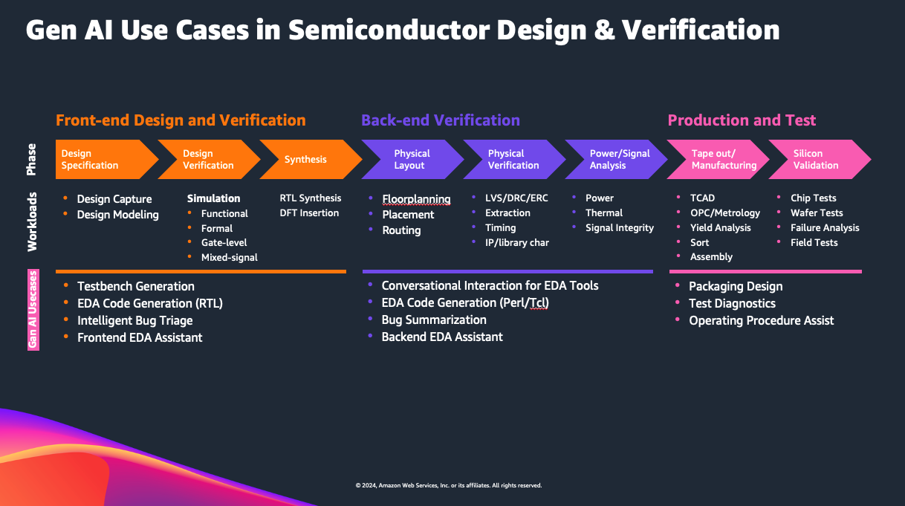

# :rocket: Generative AI for Semiconductor Design

Generative design methodologies powered by AI can automatically design chips and electronic subsystems given the right prompts and desired parameters and constraints without intensive engineering efforts, freeing up resources. For instance, generative AI engineering assistants can help new engineers become up to 2X more productive by interacting with design tools using natural language. For process improvements that directly impact project timelines and business outcomes, generative AI can facilitate rapid development of product datasheets, technical manuals, and associated documentation customized for target audiences and markets. Further efficiency gains can be realized by using engineering assistants for research and providing engineers with contextual recommendations, thereby assisting human teams to quickly address critical research problems.

For more on context on generative AI for semiconductor design, read our blog: https://aws.amazon.com/blogs/industries/generative-ai-for-semiconductor-design/ 

## Semiconductor design use cases for a typical EDA flow:

To get started with implementing a RAG based pipeline on Amazon Bedrock and Knowledge Bases, please review `rag-for-semiconductor-design`. 

To learn more on Bedrock service endpoint and AWS regions supported, please visit:
https://docs.aws.amazon.com/general/latest/gr/bedrock.html 

For more information on how to create a knowlege base, please visit:
https://docs.aws.amazon.com/bedrock/latest/userguide/knowledge-base-create.html

Disclaimer: The quality of responses will be highly dependent on the quality and quantity of the data. The more context you provide to the model, the better will be the responses.

Note: Before proceeding, please ensure you have all the packages as listed in the `requirements.txt` file. To install, use `pip install -r requirements.txt`.